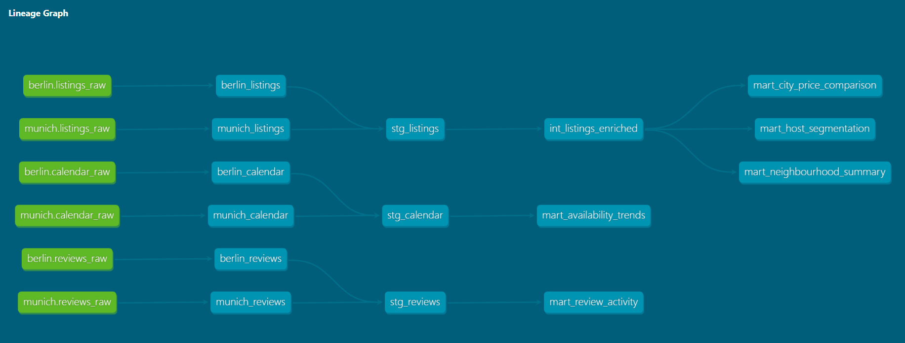
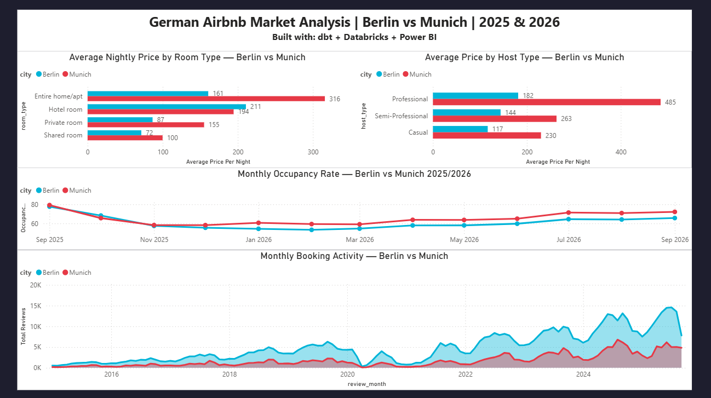

# 🏠 German Airbnb Pipeline — dbt + Databricks

An end-to-end data engineering portfolio project analyzing **9.2 million rows**
of Airbnb listing, calendar, and review data across **Berlin and Munich** using
Medallion Architecture on Databricks with dbt.

---

## 🏗️ Architecture



Data flows through three medallion layers:

| Layer | Purpose | Tables |
|---|---|---|
| **Bronze** | Raw data preserved as-is from Unity Catalog sources | 6 |
| **Silver** | Cleaned, typed, normalized and unioned across cities | 4 |
| **Gold** | Business-ready aggregations powering 5 key insights | 5 |

---

## 🛠️ Tech Stack

| Tool | Purpose |
|---|---|
| Databricks (Serverless SQL Warehouse) | Cloud data platform |
| Delta Lake + Unity Catalog | Table format and data governance |
| dbt-databricks 1.11.7 | Transformation and testing layer |
| Python + uv | Dependency and environment management |
| GitHub | Version control |

---

## 📊 Dashboard



## 📊 Key Insights

### 1. Munich commands a 2x price premium over Berlin
| Room Type | Munich Avg | Berlin Avg |
|---|---|---|
| Entire home/apt | €316 | €161 |
| Private room | €155 | €87 |
| Shared room | €100 | €72 |

### 2. Professional hosts charge significantly more
- Berlin: 153 professional hosts avg **€182/night** vs 3,643 casual hosts avg **€117/night**
- Munich: 58 professional hosts avg **€485/night** vs 3,380 casual hosts avg **€230/night**
- A small group of professional hosts disproportionately influences market pricing

### 3. Strong seasonality in Berlin occupancy
- Peak: **77.67% occupancy** in September 2025
- Trough: **53.32% occupancy** in February 2026
- 25 percentage point swing — significant revenue risk for hosts in winter months

### 4. Neighbourhood demand hotspots in Berlin
- Prenzlauer Berg Ost: 69 listings, **97 reviews per listing** — highest demand density
- Filtered to neighbourhoods with 20+ listings for statistical reliability

### 5. Booking activity peaks in summer months
- Berlin review activity peaks in **July 2025 (14,585 reviews)**
- Sharp post-September drop consistent with occupancy trends
- Reviews used as booking proxy — actual booking data not publicly available

---

## ⚙️ Setup and Usage

### Prerequisites
- Databricks workspace with Unity Catalog enabled
- Python 3.11+
- uv package manager

### Installation

```bash
# Clone the repo
git clone https://github.com/Hamza-Abbas/german-airbnb-pipeline.git
cd german-airbnb-pipeline

# Install dependencies
uv sync

# Configure Databricks connection
cp profiles.yml.example profiles.yml
# Edit profiles.yml with your Databricks host, http_path and token
```

### Running the Pipeline

```bash
# Run all models
uv run dbt run

# Run by layer
uv run dbt run --select bronze
uv run dbt run --select silver
uv run dbt run --select gold

# Run tests
uv run dbt test

# Generate documentation
uv run dbt docs generate
uv run dbt docs serve
```

---

## 🧪 Data Quality

**29 dbt tests** across all layers covering:
- Uniqueness and not-null constraints on all primary keys
- Accepted values validation for categorical columns (`city`, `room_type`, `host_type`, `price_segment`)
- Referential integrity between Silver and Gold models

---

## 🔧 Key Engineering Decisions

**Why Medallion Architecture?**
Separating Bronze/Silver/Gold means source data is never mutated. If a Silver
transformation breaks, raw data is preserved in Bronze and the pipeline can be
reprocessed without re-ingestion.

**Why `multiLine` CSV parsing?**
Airbnb listing descriptions contain embedded newlines inside quoted fields.
Standard CSV parsing shifted columns incorrectly — `multiLine` + `escape` options
in Spark resolved this.

**Why `TRY_CAST` over `CAST` for price?**
The raw price column contained mixed types (dollar strings, dates, booleans).
`TRY_CAST` returns NULL on unparseable values rather than failing the entire model.

**Why filter neighbourhoods to 20+ listings?**
Neighbourhoods with fewer than 20 listings produced statistically unreliable
averages — single luxury outliers created 10x gaps between mean and median.

---

## 📦 Data Source

[Inside Airbnb](https://insideairbnb.com/get-the-data/) — publicly available
Airbnb listing data scraped from Berlin and Munich (2025 & 2026). Used strictly for
educational and portfolio purposes.

---

## 👤 Author

**Hamza Abbas**
[GitHub](https://github.com/Hamza-Abbas) · [LinkedIn](https://www.linkedin.com/in/hamza-abbas-uni-rostock/)
